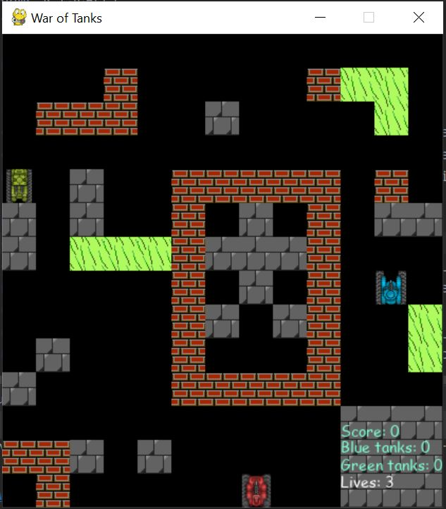

# TanksGame
In this project I present a game named Tanks built in Python using PyGame module. 
You are moving the red tank by pressing arrow key on keyboard, you can shoot by pressing space. You can walk under green bushes just like your opponents. Your job is to kill 5 blue opponents and 5 green to win the game. The blue one die after one shot and You get one points, the green one die after two shots and You get two points. You can also destroy brick walls after three shots. You have three lives.
Below is a screen of game window.

